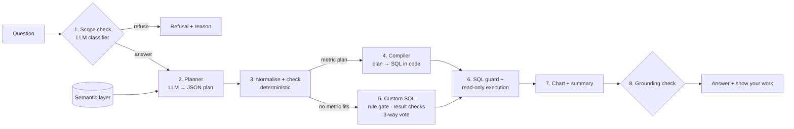

# Analytics Copilot

An AI-native, self-serve analytics copilot over **99K+ orders** from the [Olist Brazilian E-Commerce dataset](https://www.kaggle.com/datasets/olistbr/brazilian-ecommerce). Ask a business question in plain English and get an answer you can check: the governed metric it used, the SQL that ran, the assumptions it made, a chart and a short summary whose numbers are verified against the result.

- **Natural language to governed queries:** questions are translated into analytical queries over a curated warehouse, not free-form SQL against raw tables.
- **A semantic layer of 19 core governed business metrics,** plus supporting freight, payment and cohort measures, with retrieval and plan-to-SQL compilation. Answers rest on explicit business definitions (what counts as an order, a customer, a late delivery), not on the model's guess at the raw schema.
- **A golden-set evaluation framework:** **85% execution accuracy (89/105)**, and **88% of answers grounded**, meaning every number in the summary traces back to the result of the governed query.

## The core idea

Text-to-SQL demos fail quietly: canceled orders counted as sales, a delivery date used where the purchase date was meant, an average taken over item rows instead of orders. The SQL runs; the number is wrong.

The design principle that fixes this: **the language model only decides *what* is being asked. Everything that must be exactly right is decided by governed definitions and deterministic code:** filters, dates, table choice, SQL shape, safety and number checking. Accuracy rose from 5% (the model writing SQL against raw tables) to 85% by moving decisions out of the model, one class at a time.



## Algorithm, stage by stage

### 0. Warehouse: facts pre-joined, rules applied once
**Algorithm.** [warehouse.py](src/analytics_copilot/warehouse.py) builds DuckDB in three layers:
1. **Raw tables:** the CSVs loaded with every column as text.
2. **Staging views:** type every column and apply each cleaning rule as commented SQL. For example, canceled and unavailable orders get `is_valid = false`; "late" compares calendar dates; the latest review per order is kept.
3. **Three mart tables:** `fct_orders` (one row per order), `fct_order_items` (per item) and `fct_payments` (per payment). **Each carries every dimension,** including window-function results: a person's order number, the date of their next order, and a point-in-time seller tier ranked on GMV from the 3 months before the order.

**Decision.** Pre-joining means **no question ever needs a join at runtime**, which removes the largest class of text-to-SQL errors. Typing in explicit staging SQL, instead of trusting a CSV sniffer, makes every cleaning rule reviewable. Two definitions carry most of the weight:
- a customer is `customer_unique_id`, because `customer_id` is issued per order and would make repeat purchase 0%;
- every date means the **purchase** date.

### The semantic layer: the single source of truth
[semantic/metrics.yaml](semantic/metrics.yaml) holds everything the model is allowed to rely on:
- **Metrics:** 19 core governed metrics (GMV, orders, orders placed, AOV, items per order, active, new and 90-day repeat customers, active sellers, GMV per seller, freight ratio, on-time and late rate, delivery days, cancellation rate, review score, share of 1–2★ reviews, instalments, card payment share), plus supporting freight, payment and cohort measures. Each is **one aggregate expression over one table**, with its **required filters**, date field, unit and synonyms.
- **Dimensions:** state, category, payment type, seller tier, delivery status (late or on time) and customer type (first or repeat order). Each can carry its own required filter; delivery status, for example, only exists for delivered orders.
- **Business rules and a glossary:** plain-language definitions ("repeat order = order 2 onward, pooled"), shown to the model.

**Decision.** A small in-house compiler, not MetricFlow or Cube: about 300 lines of Python that fully explain every number, and a governed baseline the evaluation can trust.

### 1. Scope check: a zero-shot LLM classifier
**Algorithm.** One model call at **temperature 0**. The prompt is fixed: it describes what the warehouse contains and what it doesn't (costs, profit, carrier costs, marketing, traffic, inventory, returns, personal data, anything after October 2018), and asks for `{"in_scope": true|false, "reason": "…"}`. The boolean decides, with no threshold. A malformed reply gets one retry with the parse error. If the answer is `false`, the pipeline stops and returns the reason as the refusal.

**Decision.** Out-of-scope questions are phrased too openly for keyword rules ("what will next quarter look like", "which campaign drove orders"), so a model judges them. **Trade-offs:**
- it judges from prose, not from what the system can compute, so it can match surface words. It once refused "how many people bought for the first time" as personal data;
- it costs about 2 seconds per question.

### 2. Planner: the model classifies intent instead of writing SQL
**Algorithm.** One model call at temperature 0. The prompt holds:
- every governed metric, with its description, synonyms and whether it's additive;
- every dimension, with its **real values** read from the warehouse ('SP', 'credit_card', …);
- the glossary;
- eight worked examples.

The model returns a JSON **plan**, validated by a Pydantic schema:

| Field | Purpose | Question pattern |
|---|---|---|
| `metric` | which governed metric | "late delivery rate" |
| `group_by` / `filters` | breakdown / restriction | "by state", "in São Paulo" |
| `period` / `periods` | one period, or several side by side | "in 2018", "Q1 2017 vs Q1 2018" |
| `grain` | trend over time | "each month" |
| `share_of` | share of a total (additive metrics only) | "what % of GMV came from SP" |
| `change` | versus the previous period | "month-over-month", "biggest drop" |
| `compare` | first-to-second-period change per group | "which category grew most" |
| `min_group_size` | a threshold on each group | "among states with ≥1,000 orders" |
| `sort`, `limit` | rankings | "worst 5" |

If no metric fits **exactly**, the model answers `{"kind": "custom"}` and the question goes to step 5.

**Decision.** This is bounded semantic planning with deterministic compilation. Asking a 3B model to *classify* a question into a small vocabulary is far more reliable than asking it to *write* correct SQL. **The model names periods (`{"year": 2018, "half": 1}`) and code computes the dates,** because models get exclusive end dates wrong (30 June instead of 1 July).

### 3. Normalisation and plan checks: deterministic, before anything runs
**Algorithm.** Two passes over the plan.

**Normalisation** silently fixes mistakes that have only one correct fix:
- "orders" in a question that says "placed" → `orders_placed` (placed orders include cancellations);
- a time unit in `group_by` → `grain`;
- a date "filter" → a one-day period;
- several filter values in a comparing question ("compare SP and RJ", "for each of") → a breakdown by that dimension;
- a `limit` that would drop a compared period → removed.

**Checks** compare the plan with the question's wording, using regular expressions and word lists:
- a period named in the question but missing from the plan, or the reverse;
- a month named but not set;
- a breakdown or filter value the question never mentions (state names are matched with or without accents);
- share without share wording;
- a grain without trend wording;
- growth without `compare`;
- "month-over-month" without `change`.

Each problem becomes one sentence of feedback, and the model gets **one** repair. After that, the checks are skipped and the plan is trusted.

**Decision.** Rules in the prompt were measurably unreliable: a new instruction fixed one failure class and broke another. Checks in code aren't. Limiting the loop to one repair caps the cost of a check that misfires at a single model call.

### 4. Compiler: plan to SQL, in code
**Algorithm.** `compile_metric` ([semantic.py](src/analytics_copilot/semantic.py)):
1. **Definition:** take the metric's table and expression.
2. **Filters:** add the metric's required filters, plus those of every dimension used.
3. **Dates:** convert each period to a half-open range, and **clip it to the analysis window** (January 2017 – August 2018), so "2018" becomes January–August 2018.
4. **Shape,** by option:
   - *plain:* `SELECT dims, expr … GROUP BY ALL [HAVING COUNT(*) >= N]`;
   - *`share_of`:* aggregate per value in a CTE, then `SUM(value) FILTER (WHERE dim IN (…)) / SUM(value)`;
   - *`change`:* fetch **one grain unit before** the asked start (never before the window), compute `LAG` partitioned by the dimensions, then keep only the asked periods. January gets a real change against December;
   - *`compare`:* one CTE per period (each with the threshold), joined on the dimensions, returning the value in each period and the difference.
5. **Order:** `ORDER BY` the value, or the change, `NULLS LAST`, then `LIMIT`.

**Decision.** Everything the model could get subtly wrong (the delivered-only filter, the purchase date, the window end, the table grain, the period-over-period boundary) comes from the definition. On questions the planner can express, this route is right 89% of the time (86 of 97).

### 5. Custom SQL: for questions no metric fits
**Algorithm.**
- **Context:** the table definitions with column notes, the metrics retrieved for the question, every dimension's values, the glossary, similar example queries, and the business rules. The rules go last, where small models follow them best.
- **Retrieval** is lexical. Question and metric text are tokenised (lower case, stopwords removed, plural *s* stripped). Each metric scores **3 per shared word with its name, label or synonyms, plus 1 per shared word with its description**, and the top 4 are kept. The top 3 example queries by word overlap (Jaccard) are added.

Then **self-consistency** over 3 candidates:
```
for sample in 0, 1, 2:
    sql = model(prompt, temperature 0 for sample 0, else 0.7 with seed = sample)
    if rule_gate(sql) finds violations:  sql = one repair naming them
    rows = guard + execute                (one repair on a validation or execution error)
    if result_checks(rows) find problems: one fix, kept only if it has fewer problems
answer = the result most candidates share (ties go to the greedy candidate)
```

**The rule gate** reads the SQL's structure with sqlglot and flags:
- no purchase-date filter, or filtering on another date column;
- a metric used without its required filter;
- delivery measures without `is_delivered`;
- sales figures without `is_valid`;
- a join of two row-level fact tables on a dimension alone. Every São Paulo order would meet every other São Paulo order: about 800 million rows.

**The result checks** flag:
- an empty result;
- dates outside the window;
- an all-NULL column;
- two value columns that are identical in every row (a split that didn't happen);
- a change that's empty only in the first period;
- a single value for a question that compares groups.

**The vote** fingerprints each result: rows sorted, numbers rounded to 6 significant digits, so equivalent queries vote together. Fixed seeds make reruns repeatable.

**Decisions:**
- **Lexical retrieval, not embeddings:** the corpus is small and curated, synonyms do the job embeddings would, there's no extra model on the GPU, and every retrieval can be explained by the words that matched.
- **Result feedback:** execution-feedback refinement is the one add-on that research found helps across models at low cost.
- **Majority voting** follows OmniSQL and CHASE-SQL.
- **No cost check before execution:** DuckDB's `EXPLAIN` estimated 1.3M rows for the 800M-row blow-up. Reading the join condition catches it; the estimate doesn't.

### 6. SQL guard and execution: two independent defences
**Algorithm.**
- **The guard** ([sql_guard.py](src/analytics_copilot/sql_guard.py)) parses the SQL with sqlglot. It requires exactly one statement, and that it be a SELECT (or a UNION of SELECTs). It walks the whole query tree and rejects any write or admin node, including a `DELETE` hidden inside a `WITH`. Tables must be allowed or be CTEs, so `read_csv` and other table functions are rejected. Column names must exist in some allowed table or be defined in the query. A missing `LIMIT` is added and a larger one lowered.
- **The executor** ([executor.py](src/analytics_copilot/executor.py)) opens a fresh DuckDB connection per query, **read-only with file and network access disabled**. It runs the query in a worker thread, so the API stays async, while a timer calls `interrupt()` after 10 seconds. Decimals and time intervals come back as plain numbers.

**Decision.** A parser can miss an edge case. Read-only mode, blocked file access and the timeout hold even if the guard is wrong, and each is tested on its own.

### 7. Chart and summary
**Algorithm.**
- **The chart** is chosen from the result's shape:
  - one numeric value → a number tile;
  - a date column plus numbers → a line, with an optional series;
  - one category column plus numbers (50 rows or fewer) → a bar;
  - anything else → a table.

  The model's hint is used only if the data supports it.
- **The summary:** the model writes 2–3 sentences from the first 30 rows only, with no speculation, in English number format.

### 8. Grounding check: every number must trace to the rows
**Algorithm.** A regular expression extracts every number from the summary, reading R$, %, k/M/million and thousands separators. Each must match one candidate:
- a result cell;
- a ratio written as a percentage;
- a column total;
- a difference, ratio or % change between two values in the same column (only for columns of 24 values or fewer, where chance matches stay unlikely);
- the row count or a rank;
- a date part;
- a number from the question.

The tolerance is half a unit of the last digit shown plus 0.5%, so 0.06791 matches "6.8%". If any number fails, the summary is regenerated once with the failing numbers named. If it fails again, a template built from the first row replaces it.

**Decision.** It's deterministic and explainable: a failure lists the exact numbers that couldn't be traced. **Trade-off:** it verifies numbers, not claims. "Sales rose" over falling rows would pass.

## Evaluation

The golden set in [evals/golden.yaml](evals/golden.yaml) has 120 questions: 40 easy, 45 medium, 20 hard, and 15 that should be refused. Each has hand-written gold SQL, and items are reviewed by the project owner before they're marked verified. The gold SQL is written directly against the warehouse, never generated by the system under test.

**Scoring algorithm** ([scoring.py](src/analytics_copilot/evals/scoring.py)):
1. **Normalise cells:** numbers become floats; dates and midnight timestamps become ISO dates; text is trimmed and lower-cased.
2. **Match columns by content:**
   - for each gold column, find the predicted columns whose values match as a set, also accepting ×100 (a ratio shown as a percentage) and a year given as its 1 January date;
   - try each assignment of distinct predicted columns to gold columns. Extra predicted columns are ignored.
3. **Compare rows:** position by position for rankings, otherwise as sorted sets. Floats get a relative tolerance of 0.1%.
4. **Fallback for pivoted results:** if the result spreads groups across columns, melt 2–4 numeric columns into rows and match again.
5. **Failure label,** from comparing the predicted and gold SQL structures, in this order: made-up column → different tables → different aggregate or missing definition filter → different time grain → different filters or dates.

**Results** (Qwen2.5-Coder-3B-Instruct, served with vLLM on a Kaggle T4):

| Approach | Execution accuracy |
|---|---|
| Raw schema only | 5% |
| Semantic layer in the prompt | 42% |
| Semantic layer + retrieval | 60% |
| **Semantic planning + compilation (final)** | **85% (89/105)** |

| Final system | |
|---|---|
| Execution accuracy | **85% (89/105)**; easy 39/40, medium 38/45, hard 12/20 |
| Grounded summaries | **88%** |
| Out-of-scope questions correctly refused | 15/15 |
| Median latency | about 11 s per question on a T4 |

The full reports are in [results/](results/). Every design decision, with its alternatives and trade-off, is logged in [DECISIONS.md](DECISIONS.md), including failures and what they taught.

**Known limits:**
- **Multi-step questions** outside the plan language (cohorts with custom horizons, conditions on each order) still depend on model-written SQL, which is where most remaining errors are. The next step is a stronger SQL model for that route only.
- **The scope check** judges from a description, not from what the planner can compute.

## Run it

Needs [uv](https://docs.astral.sh/uv/) and a Kaggle API token saved to `~/.kaggle/access_token`.

```bash
make install     # dependencies
make data        # download the Olist CSVs into data/raw/
make warehouse   # build warehouse/olist.duckdb
make test        # 347 tests: guard, compiler, planner, pipeline, API, scorer
make serve       # FastAPI on http://localhost:8080 (point .env at an OpenAI-compatible LLM)
```

| Endpoint | What it does |
|---|---|
| `POST /ask` `{question}` | Governed answer with SQL, metric definitions, assumptions, route and plan, chart spec, rows, grounded summary, latency and tokens |
| `GET /metrics` | The semantic-layer catalogue |
| `GET /health` | Liveness and configuration |

**GPU evaluation on Kaggle:**
1. `make kaggle-code` uploads the committed code as a private dataset.
2. `make kaggle-eval` runs [kaggle/eval/run_eval.ipynb](kaggle/eval/run_eval.ipynb) on a T4: it installs the pinned vLLM stack, builds the warehouse and runs the evaluation, 4 questions at a time.
3. `make kaggle-eval-results` downloads the reports.

## Stack

Python 3.12 · DuckDB · sqlglot · Pydantic · FastAPI · OpenAI-compatible client (vLLM, or any hosted provider by config) · pytest · ruff · Kaggle T4 for model serving.

Data: Olist, [CC BY-NC-SA 4.0](https://creativecommons.org/licenses/by-nc-sa/4.0/). Raw data isn't included; `make data` downloads it.
