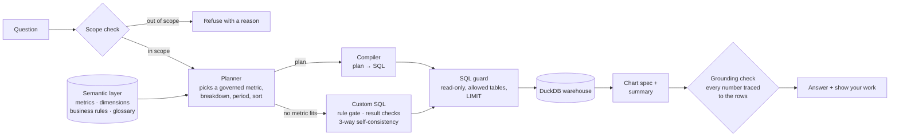

# Analytics Copilot

An AI-native, self-serve analytics copilot over **99K+ orders** from the [Olist Brazilian E-Commerce dataset](https://www.kaggle.com/datasets/olistbr/brazilian-ecommerce). Ask a business question in plain English and get an answer you can check: the governed metric it used, the SQL that ran, the assumptions it made, a chart and a short summary whose numbers are verified against the result.

- **Natural language to governed queries:** questions are translated into analytical queries over a curated warehouse, not free-form SQL against raw tables.
- **A semantic layer of 19 core governed business metrics,** plus supporting freight, payment and cohort measures, with retrieval and plan-to-SQL compilation. Answers rest on explicit business definitions (what counts as an order, a customer, a late delivery), not on the model's guess at the raw schema.
- **A golden-set evaluation framework:** **85% execution accuracy (89/105)**, and **88% of answers grounded**, meaning every number in the summary traces back to the result of the governed query.

## Why

Text-to-SQL demos look good until the numbers are wrong in ways nobody notices: canceled orders counted as sales, a delivery date used where the purchase date was meant, an average taken over item rows instead of orders. This project treats that as the core problem. The model decides *what* is being asked, governed definitions and deterministic code decide *how* it's computed, and every answer shows its work.

## How it works



1. **Scope check.** Questions the data can't answer (profit, personal data, forecasts, traffic) are refused with a reason.
2. **Planner.** For most questions the model doesn't write SQL at all. It returns a small plan: which governed metric, which breakdown, which period, and any sort, top-N, comparison or period-over-period change. Deterministic checks catch invented periods, filters or breakdowns before the plan is used.
3. **Compiler.** Code turns the plan into SQL. Required filters, the date field, the analysis window and the correct table come from the semantic layer, so they can't be got wrong.
4. **Custom SQL** (only when no metric fits). The model writes SQL with the relevant definitions and examples in context. A rule gate checks it against the business rules before it runs; result checks catch empty, out-of-window or mis-shaped results; three candidates are generated and the majority result wins.
5. **SQL guard and execution.** Queries are validated with sqlglot (one SELECT, allowed tables and columns, LIMIT enforced). They run on a read-only DuckDB connection with file access disabled and a timeout.
6. **Answer.** A chart spec is chosen from the shape of the result, and a 2–3 sentence summary is written from the rows only. The grounding check verifies every number in it; if one can't be traced, the summary is regenerated once and then replaced by a template.

Every answer returns: the SQL, the tables used, the metric definitions, the assumptions (date field, filters, data coverage), the chart spec, the rows, latency by stage and token usage.

## Semantic layer

Defined in [semantic/metrics.yaml](semantic/metrics.yaml):

- **19 core governed metrics:** GMV, orders, orders placed, AOV, items per order, active, new and 90-day repeat customers, active sellers, GMV per seller, freight ratio, on-time and late delivery rate, average delivery days, cancellation rate, average review score, share of 1–2★ reviews, credit-card instalments, and credit-card payment share. Supporting measures cover total freight, freight per order, payment value, canceled orders, median delivery days and customer cohorts.
- Each metric has a description, an SQL expression, its grain, required filters, a date field, a unit and synonyms.
- **Dimensions:** customer state, product category, payment type, seller tier (point-in-time, from trailing GMV), delivery status (late or on time) and customer type (first or repeat order). Time grains run from day to year.
- **Business rules and a glossary** capture the decisions that make numbers trustworthy: canceled and unavailable orders aren't sales; delivery metrics use delivered orders; every date is the purchase date; a customer is a person (`customer_unique_id`), not an order id.

The warehouse ([src/analytics_copilot/warehouse.py](src/analytics_copilot/warehouse.py)) loads the raw CSVs as text, types and cleans them in staging views (every rule commented), and materialises pre-joined order, item and payment tables. The data profile and quirks are in [data/README.md](data/README.md).

## Evaluation

The golden set in [evals/golden.yaml](evals/golden.yaml) has 120 questions: 40 easy, 45 medium, 20 hard, and 15 that should be refused. Each has hand-written gold SQL, and items are reviewed by the project owner before they're marked verified.

- **Execution accuracy:** the predicted result must match the gold result. Columns are matched by content, row order matters only for rankings, and floats get a 0.1% tolerance.
- **Also measured:** refusal accuracy, grounding pass rate, p50/p95 latency, tokens, repair rate, and a failure taxonomy (wrong filter, wrong metric definition, wrong time grain, wrong table, hallucinated column).

**Results** (Qwen2.5-Coder-3B-Instruct, served with vLLM on a Kaggle T4):

| Approach | Execution accuracy |
|---|---|
| Raw schema only | 5% |
| Semantic layer in the prompt | 42% |
| Semantic layer + retrieval | 60% |
| **Semantic planning + compilation (final)** | **85% (89/105)** |

| Final system | |
|---|---|
| Execution accuracy | **85% (89/105)**; easy 39/40, medium 38/45, hard 12/20 |
| Grounded summaries | **88%** |
| Out-of-scope questions correctly refused | 15/15 |
| Median latency | about 11 s per question on a T4 |

The full reports are in [results/](results/). Every design decision, its alternatives and its trade-off is logged in [DECISIONS.md](DECISIONS.md), including the failures and what they taught.

**Known limits:** multi-step questions that fall outside the plan language (for example cohorts with custom horizons, or conditions tested on each order) still go to model-written SQL. That's where most remaining errors are, and the next step is a stronger SQL model for that route only.

## Run it

Needs [uv](https://docs.astral.sh/uv/) and a Kaggle API token saved to `~/.kaggle/access_token`.

```bash
make install     # dependencies
make data        # download the Olist CSVs into data/raw/
make warehouse   # build warehouse/olist.duckdb
make test        # 347 tests: guard, compiler, planner, pipeline, API, scorer
make serve       # FastAPI on http://localhost:8080 (point .env at an OpenAI-compatible LLM)
```

| Endpoint | What it does |
|---|---|
| `POST /ask` `{question}` | Governed answer with SQL, metric definitions, assumptions, chart spec, rows, grounded summary, latency and tokens |
| `GET /metrics` | The semantic-layer catalogue |
| `GET /health` | Liveness and configuration |

**GPU evaluation on Kaggle:**
1. `make kaggle-code` uploads the committed code as a private dataset.
2. `make kaggle-eval` runs [kaggle/eval/run_eval.ipynb](kaggle/eval/run_eval.ipynb) on a T4: it installs the pinned vLLM stack, builds the warehouse and runs the evaluation, 4 questions at a time.
3. `make kaggle-eval-results` downloads the reports.

## Stack

Python 3.12 · DuckDB · sqlglot · Pydantic · FastAPI · OpenAI-compatible client (vLLM, or any hosted provider by config) · pytest · ruff · Kaggle T4 for model serving.

Data: Olist, [CC BY-NC-SA 4.0](https://creativecommons.org/licenses/by-nc-sa/4.0/). Raw data isn't included; `make data` downloads it.
